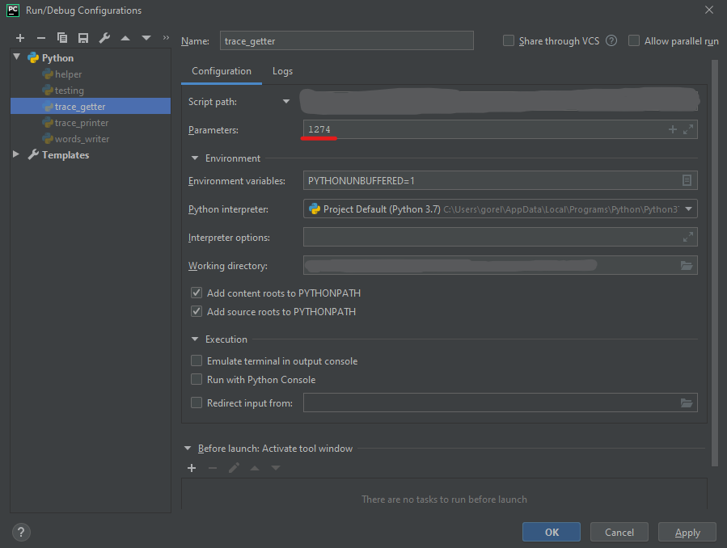
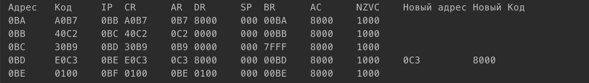

# Утилита для работы с БЭВМ
## Краткое описание
Данная утилита призвана упростить выполнение второй лабораторной работы по ОПД. \
Принцип работы трасировки заключается в том, что утилита делает скриншот каждой области интерфейса, где содержатся данные, на каждом шаге выполнения программы.

## Инструкция
1. В директорию ```variants/``` добавить текстовый файл с исходным кодом программы, \
```
0B7a
0200v
0100v
E0B7v
A0C3+
40B8
E0B7
0200
30C2
30B7
E0B9
0100
30B7v
E0B7v
```
где
- ```v``` указывает на перемнную
- ```a``` указывает на адрес
- ```+``` указывает начало работы программы

1. В аргументах ```trace_printer``` или ```words_writer``` (в зависимости от конкретной задачи) указать имя файла .txt с иходным кодом программы. \

2. Запустить программу

**!!! Окна БЭВМ и PyCharm должны находиться в одном переключении по Alt+Tab !!!**

На выходе получится трасировка, представленная в нескольких видах:
- Вывод в консоль

- Файлы формата .txt и .csv в директории ```/tracing```